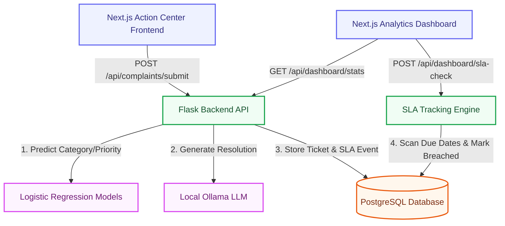

# CogniSolve AI — Intelligent Complaint Classification & Resolution System

<div align="center">
  
</div>

**CogniSolve AI** is an advanced, enterprise-grade customer support platform designed to fully automate the ingestion, classification, prioritization, and resolution drafting of incoming complaints. 

By seamlessly blending traditional Full-Stack architecture with **Real-Time Machine Learning**, **Service Level Agreement (SLA) Tracking**, and **Generative AI**, CogniSolve eliminates manual ticket triaging and ensures high-priority issues are never missed.

---

## 🌟 Core Capabilities

*   **Intelligent Auto-Classification**: Automatically reads and categorizes complaints into `Product`, `Packaging`, or `Trade` using custom NLP models.
*   **Predictive Escalation**: Intelligently predicts whether a complaint is `High`, `Medium`, or `Low` priority based on its text, calculating strict SLAs inherently.
*   **Active SLA Breach Engine**: A proactive daemon checks all tickets against their calculated deadlines, instantly marking them as *Breached* if they exceed designated timeframes.
*   **Generative AI Resolution**: Recommends human-readable, context-aware resolution paths automatically utilizing an integrated local LLM (Ollama).
*   **Model Explainability**: Eradicates the "Black Box" of ML. The system tells your QA team *why* it made its decision by exposing the top keywords and providing natural language rationales (e.g., *"Model detected high-severity patterns with 85% confidence"*).
*   **Next.js 16 Executive Dashboards**: Ships with 3 beautiful, role-based dashboards with real-time countdown timers, interactive metrics, and KPI tracking.

---

## 🧠 The Machine Learning Engine

CogniSolve’s ML architecture is built directly into the backend using `scikit-learn`.

### The Dual-Model Pipeline
The backend utilizes two distinct **Logistic Regression (`lbfgs` multinomial)** models, heavily optimized for text classification. 

1.  **Feature Extraction Pipeline**:
    *   **TF-IDF Vectorization**: Parses the raw complaint text into a highly dimensional token space (max 5,000 features).
    *   **Truncated SVD**: Reduces dimensionality (to 100 components), filtering noise and isolating core semantic concepts.
    *   **Domain Metadata Injection**: Combines the SVD output with specific Keyword Urgency Scores, Word Lengths, and Output Counts to generate the final matrix (`FeatureEngineer.transform`).
2.  **Category Classifier**: Predicts the exact department responsible for resolution.
3.  **Priority Classifier**: Determines the urgency constraint (predicting High, Low, or Medium).

### Explainable AI (XAI)
To provide transparent reasoning, the training pipeline computes **Keyword Associations** directly from model coefficients. When an Executive views an individual ticket, the UI dynamically extracts the top 5 influencing keywords and reveals the per-class probability mappings.

---

## 🏗️ System Architecture



### Database Schema Structure
The application relies on 4 robust PostgreSQL tables:
*   `complaints`: Core record repository (ID, Category, Priority, SLA Deadline, Confidence Score).
*   `sla_events`: Full immutable transaction log tracking ticket lifecycle events ("created", "assigned", "breached", "resolved").
*   `classification_labels`: Static lookup tables.
*   `agents`: Pre-configured user/agent identities.

*(The Flask application utilizes automatic DDL definitions, provisioning these tables automatically on boot if they are missing).*

---

## 🚀 Installation & Setup Guide

### 1. Prerequisites
Ensure you have the following installed locally:
*   **Python:** $\ge$ 3.10
*   **Node.js:** $\ge$ 18.x
*   **PostgreSQL:** $\ge$ 14 (Running on port `5432` with a `postgres` user)
*   **Ollama:** Optional, required only for generative resolutions. Pull the default model using: `ollama run llama3`.

### 2. Environment Configuration
Create a `.env` file in the root backend directory:

```env
# Database Settings
DB_HOST=localhost
DB_PORT=5432
DB_NAME=cognisol
DB_USER=postgres            # Ensure this matches your local PG user
DB_PASSWORD=postgres        # Ensure this matches your local PG password

# SLA Targets (in hours)
SLA_HIGH_HOURS=4
SLA_MEDIUM_HOURS=12
SLA_LOW_HOURS=24
```

*Note: You must manually create an empty database named `cognisol` in PostgreSQL before starting the server:*
> `CREATE DATABASE cognisol;`

### 3. Initialize the Backend
Open a terminal in the project root:

```bash
# Initialize a virtual environment
python -m venv venv

# Activate it (Windows)
venv\Scripts\activate

# Install all backend requirements
pip install -r requirements.txt
```

### 4. Train the ML Models
Before running the server, the Machine Learning algorithms must interpret the local dataset (`datasets/TS-PS14.csv`) to build the `.joblib` model trees.

```bash
# This script processes 50,000 baseline records and caches the resulting models.
python -m services.train_model
```
Once you see `Training Complete! Models saved!`, you are clear to proceed.

### 5. Running the Application Stack

**A. Start the API/ML Backend:**
Still inside your activated Python environment:
```bash
python run.py
```
> The API forms the logic core of the application and heavily manages the PostgreSQL lifecycle. It binds to `http://localhost:5000`.

**B. Start the Frontend Framework:**
Open a *new* terminal window, leave your backend running, and navigate to the frontend UI root:
```bash
cd frontend

# Install Node modules if you haven't yet
npm install

# Start the Next.js standard dev environment
npm run dev
```

### 6. Explore
Open `http://localhost:3000` in your web browser. 
Navigate to the **Action Center** to begin simulating customer complaints and watching the AI process them in real-time.

---

## 📖 Key API Endpoints Reference

| Method | Endpoint | Description |
| :--- | :--- | :--- |
| `POST` | `/api/complaints/submit` | Send `{"text": "...", "channel": "web"}` to execute full ML pipeline processing + LLM resolution drafting. |
| `PATCH` | `/api/complaints/:id/status` | Mark a ticket as `in_progress`, `resolved`, or `closed`. |
| `GET` | `/api/dashboard/stats` | Fetches aggregated chart data (Categories, SLAs, Volumes) alongside real-time live SLAs for active widgets. |
| `POST` | `/api/dashboard/sla-check` | Pings the SLA Engine to parse all Active tasks and stamp overdue queries directly into the DB as `breached`. |
| `GET` | `/api/export/pdf` | Downloads a comprehensive structural PDF report utilizing ReportLab. |
